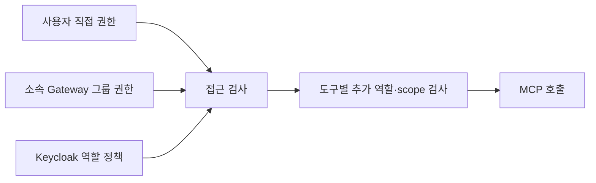

# MCP Gateway

**웹 관리 콘솔과 Keycloak 인증을 갖춘 MCP Gateway입니다.**
MCP 서버를 연결하고 사용자·그룹별 접근 권한을 설정합니다.
Node.js **22.17 이상**, npm을 사용합니다.

## 바로 화면 보기

```sh
npm ci
npm run dev:demo
```

브라우저에서 **http://127.0.0.1:3000** → **로컬 데모 열기**를 누르세요.
외부 계정 없이 데모 MCP 2개와 모든 관리 메뉴를 확인할 수 있습니다.
데모는 인증을 생략하는 loopback 전용 개발 모드이며 실제 권한 차단 검증은 Keycloak 모드에서 합니다.

| 메뉴      | 할 수 있는 일                                              |
| --------- | ---------------------------------------------------------- |
| 대시보드  | 연결된 MCP·도구·사용자·권한 개수, 최근 활동, MCP 주소 복사 |
| MCP 서버  | 외부 HTTP MCP 등록·수정·삭제, 연결 확인, 도구 목록 조회    |
| 사용자    | Keycloak 사용자 연결·동기화, 사용자별 MCP 허용·차단        |
| 그룹      | Gateway 그룹 생성, 구성원 관리, 그룹별 MCP 허용·차단       |
| 감사 기록 | 권한 변경·MCP 관리·도구 호출 결과 확인                     |

일반 사용자는 대시보드와 자신에게 허용된 MCP만 볼 수 있습니다.
관리 API는 Keycloak의 **`mcp-gateway` client → `gateway-admin` 역할**을 요구합니다.
도구 사용용 `admin` 역할은 콘솔 관리 권한과 구분합니다.

## 실제 Keycloak 로그인

Docker Compose가 필요합니다. 이미 데모를 실행하고 있다면 `Ctrl+C`로 종료하세요.

1. 환경변수 파일을 만듭니다.

   ```sh
   cp .env.example .env
   ```

   `KEYCLOAK_ADMIN_PASSWORD`, `GATEWAY_SMOKE_CLIENT_SECRET`, `KEYCLOAK_DIRECTORY_SECRET`,
   `KEYCLOAK_CONSOLE_PASSWORD`에 서로 다른 임의의 비밀 값을 입력합니다.

2. Keycloak을 시작합니다.

   ```sh
   docker compose -f compose.keycloak.yml up -d
   ```

   `http://127.0.0.1:8080`이 열릴 때까지 기다립니다. 최초 시작 시 realm을 import합니다.

3. Gateway를 시작합니다.

   ```sh
   npm run dev
   ```

   이 명령은 `.env`를 로딩합니다. 관리 콘솔은 `http://127.0.0.1:3000`입니다.

4. **Keycloak으로 로그인**을 누릅니다.

   계정은 `console-admin`, 최초 비밀번호는 `KEYCLOAK_CONSOLE_PASSWORD`입니다.
   첫 로그인에서 새 비밀번호를 설정합니다. 이 계정은 콘솔 관리자이며, 도구 사용 권한은
   사용자·그룹 메뉴에서 별도로 부여해야 합니다.

5. **사용자 → Keycloak 동기화**로 계정을 가져오고 MCP 권한을 설정합니다.

   일반 로그인 계정의 생성·비활성화는 Keycloak 관리 화면에서 처리합니다.
   realm 관리자 로그인은 `admin` / `KEYCLOAK_ADMIN_PASSWORD`입니다.

추가 설정과 기존 realm 적용 방법은 [Keycloak 연동 안내](docs/keycloak.md)를 참고하세요.
`npm run smoke:keycloak`는 실제 Keycloak 서비스 계정으로 MCP 인증·호출·차단을 확인합니다.

## 권한이 적용되는 방법



**명시적 차단 → 직접·그룹 허용 → 역할 정책 → 기본 거부** 순서입니다.
사용자나 어느 소속 그룹에든 차단이 있으면 다른 허용보다 우선합니다.
화면의 **기본값**은 직접 규칙을 제거하고 그룹·역할 정책을 따릅니다.
도구별 추가 조건은 사용자·그룹의 MCP 허용으로 우회하지 못합니다.

그룹과 구성원은 Gateway에서 관리하며 Keycloak의 그룹 계층과 별개입니다.
권한·그룹 구성원 변경은 **같은 토큰으로 보내는 다음 MCP 요청부터** 반영됩니다.
이미 실행 중인 외부 작업을 되돌리지는 않습니다.
Keycloak 역할·계정 상태 변경은 기존 JWT 만료 전까지 남을 수 있습니다.

## 외부 MCP 등록

**MCP 서버 → MCP 서버 추가**에서 URL, 서버 ID, 인증 방식을 선택하세요.
활성화 상태로 저장하면 실제 초기화·도구 조회가 성공한 후 등록됩니다.
등록 직후에는 기본 거부이며 사용자나 그룹에 권한을 부여해야 사용할 수 있습니다.

| 외부 인증         | 설정                                                   |
| ----------------- | ------------------------------------------------------ |
| 인증 없음         | 공개 MCP                                               |
| API Key           | 헤더 이름 + 등록된 자격 증명 참조                      |
| Bearer Token      | 등록된 토큰 참조                                       |
| OAuth 서비스 계정 | Token URL, Client ID, secret 참조, 선택 scope·resource |

비밀 값은 배포 환경변수로 주입하고 `console.credentialEnvs`에 허용한 이름만 웹에서 선택합니다.
운영 모드는 `console.allowedUpstreamOrigins`에 등록된 도메인으로만 새 연결을 만들 수 있습니다.
MCP URL과 OAuth token URL의 origin 모두 등록해야 합니다.

```json
{
  "console": {
    "enabled": true,
    "databasePath": "data/gateway.sqlite",
    "credentialEnvs": ["VENDOR_MCP_API_KEY"],
    "allowedUpstreamOrigins": ["https://mcp.vendor.example"]
  }
}
```

전체 운영 예제는 [examples/mcp-gateway.production.json](examples/mcp-gateway.production.json)입니다.
웹 등록은 HTTP MCP만 지원합니다. 로컬 stdio 명령은 설정 파일에서 등록하며,
웹 화면에서 임의의 셸 명령을 만들 수 없습니다. 파일 서버의 접근 권한은 웹에서도 관리합니다.

외부 OAuth는 `client_credentials` / `client_secret_post` 방식입니다.
**사용자별 외부 OAuth 계정 연결·동의·refresh token 보관은 구현하지 않았습니다.**
Gateway 로그인 토큰을 외부로 전달하지 않고 별도 서비스 자격 증명을 사용합니다.
외부 MCP 호출마다 연결을 분리하므로 사용자끼리 MCP 세션을 공유하지 않습니다.
외부 서비스에는 동일한 서비스 계정으로 보이므로 그 계정의 데이터 권한 범위를 사용합니다.

## MCP 클라이언트 연결

MCP 주소는 `http://127.0.0.1:3000/mcp`입니다.
클라이언트에는 Keycloak에서 발급한 access token이 필요합니다. 권한이 있는 도구만
`서버ID__도구이름` 형식으로 나타납니다. 예: `alpha__echo`.

Gateway는 OAuth Protected Resource Metadata를 공개합니다.
JWT의 `aud`는 `publicUrl`과 정확히 같아야 합니다.
일반 MCP 클라이언트의 PKCE callback·client ID는 실제 클라이언트에 맞게 Keycloak에 등록하세요.

## 저장·배포

콘솔 데이터는 SQLite의 서버 연결 정보·사용자·그룹·권한·감사 테이블에 보관합니다.
운영 데이터 기본 경로는 `data/gateway.sqlite`, 데모는 `data/demo.sqlite`입니다.
**현재 배포 단위는 단일 Gateway 인스턴스입니다.** 여러 replica의 정책·catalog 동기화는
구현하지 않았습니다. SQLite 파일/WAL은 영속 볼륨에서 보관하고 일관된 백업을 수행하세요.

```sh
npm run build
NODE_ENV=production MCP_GATEWAY_CONFIG=mcp-gateway.local.json node --env-file=.env dist/index.js
```

`mcp-gateway.local.json`은 운영 예제를 복사해 실제 URL과 자격 증명 참조를 설정합니다.
운영 모드는 Keycloak 인증과 외부 HTTPS URL을 강제합니다.
`NODE_ENV=production`에서 인증 없는 개발 설정은 시작되지 않습니다.

```sh
docker build -t mcp-gateway:0.2.0 .
docker run --rm --read-only --cap-drop=ALL --security-opt=no-new-privileges \
  -p 127.0.0.1:3000:3000 \
  -v "$PWD/mcp-gateway.local.json:/app/config/mcp-gateway.json:ro" \
  -v mcp-gateway-data:/app/data \
  -e VENDOR_MCP_API_KEY -e INTERNAL_MCP_CLIENT_SECRET -e KEYCLOAK_DIRECTORY_SECRET \
  mcp-gateway:0.2.0
```

Gateway 포트는 TLS reverse proxy 뒤의 사설 네트워크에 둡니다.
실제 proxy IP/CIDR만 `trustedProxies`에 설정하고 `Host`를 public hostname으로 전달하세요.
공개 도메인에서 쓸 Keycloak 콘솔 callback과 Web Origin도 함께 변경합니다.
로컬 Keycloak Compose의 `start-dev`는 운영 배포용이 아닙니다.

운영 제한, 감사 기록, 상태 점검은 [구조와 운영 범위](docs/architecture.md)에 정리했습니다.
다음 구현·운영 순서는 [로드맵](docs/roadmap.md)에 정리했습니다.
SQLite 백업·복구 명령과 Docker 없는 실제 Keycloak 검증은 [운영 가이드](docs/operations.md)를 참고하세요.

## 검증 명령

```sh
npm run check
npx playwright install chromium
npm run test:ui
npm audit --omit=dev --audit-level=high
```

서버·웹·테스트 타입 검사, API/MCP 통합 테스트, 웹 빌드를 수행합니다.
브라우저 테스트는 별도 테스트 IdP로 PKCE 로그인·로그아웃·그룹 및 사용자 권한·MCP 등록·
모바일 화면을 검증합니다. 이 테스트 IdP는 운영 코드에 포함되지 않습니다.
실제 Keycloak 기동 검증은 `npm run smoke:keycloak`로 별도 수행해야 합니다.

코드 정리는 `npm run format`, 형식 검사는 `npm run format:check`입니다.
CI 설정에는 검사·브라우저 테스트·운영 의존성 audit·Docker 빌드를 포함했습니다.
